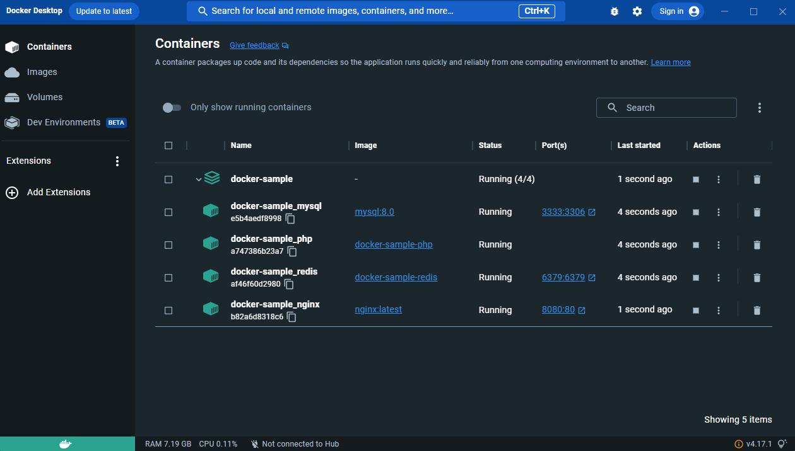

## DOCKER COMMANDS



```SHELL
$ docker-compose down
$ docker-compose up -d --build
$ docker exec -it <CONTAINER_NAME>
```

## REDIS COMMANDS

```SHELL
$ redis-cli -a teste123456 -p 6379
$ SCAN
$ keys *
$ get <key>
$ flushall
$ ttl <key>
```


## DOCTRINE COMMANDS

```SHELL
$ php bin/console doctrine:database:create
$ php bin/console make:entity
$ php bin/console make:migration
$ php bin/console doctrine:migrations:migrate
```